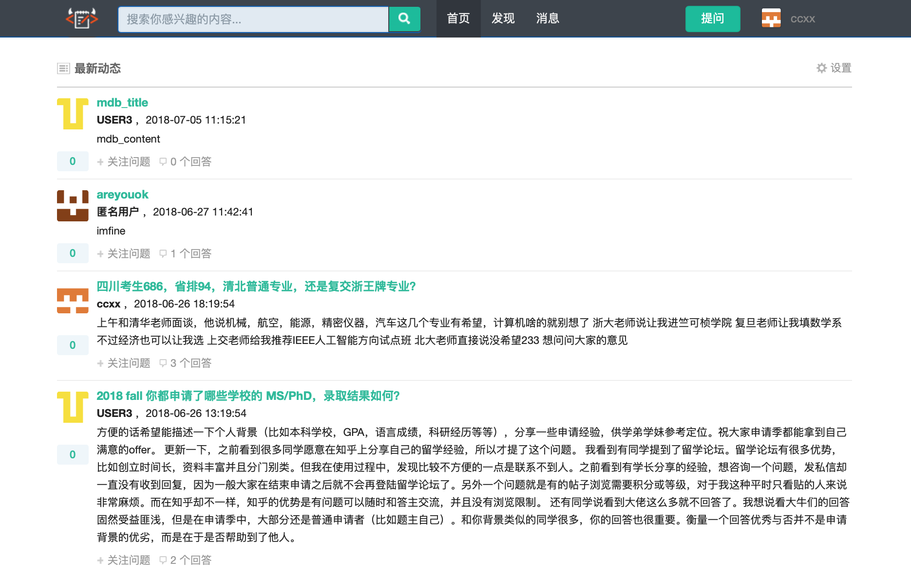

# Wenda
-------------

类似知乎的一个问答社区网站，包括用户注册登录管理、邮件激活改密码、问题和回答的发布赞踩以及评论、站内关注和私信等社交功能、敏感词过滤、异步任务设计、timeline的实现等。

#### 示例:  

### 设计思路

- **1.开发工具**：Git，Intelli J。涉及技术：Java，Spring，Spring Boot，Velocity，MyBatis等。

- **2.登录注册**：使用拦截器实现；为了安全，密码加随机 salt，并采用 MD5加密；实现**单点登录**，初次登录的时候生成 ticket ，放在数据库里，还可以优化后放在Redis里（key - userId, EXPIRE），并随 cookie 一起返回浏览器；这样使用分布式统一登录系统，登录后 ticket 有效，所有相关平台都登录了，如百度、百度音乐、百度文库等；登录注册的验证，邮件激活。

- **3.敏感词过滤**：先构造一个前缀树，再通过有限状态机实现检测文本是否包含并替换掉敏感词，优点：有扩展性，方便添加过滤词；复杂度小，性能的提高。

- **4.Redis**：常用数据结构，String、Hash、List、Set、Zset(Sorted Set)；用在异步框架里实现赞踩、发邮件，以及排行榜里等地方。使用 Sorted Set 存储 关注某个用户或问题 的数据，key 为 FOLLOWER:EntityType.ENTITY_QUESTION:qId，score 为当前日期，set 里存储 userId，进行关注、取关、获取用户/问题的所有关注者、查看关注的所有用户/问题、关注数等操作。类似的使用 Set 记录对问题/回答的赞踩，赞踩两个操作互斥。使用 List 队列存储不同类型的异步任务。

- **5.异步框架**：负载多，为了能把结果更快反馈给用户，一些任务使用底层数据结构用Redis的队列写的异步框架执行，因为Redis能保证性能同步，还可以用优先队列可以把紧急任务优先处理掉，消息的发射、处理、事件的模型定义、具体handler，定义了一些公共接口。异步任务包括：新发布问题在 solr 中添加索引、回答或关注问题时对所有关注者推送新鲜事至 timeline、被关注时和被赞时发送系统私信、用户登录时发送邮件。

- **6.发送邮件**：SSL连接，邮箱开启账号设置授权才可以发送。

- **7.内容排序算法**：把好的内容挑选出来，可参考 Quora、Reddit、StackOverflow 等网站使用的排序算法。

- **8.推拉timeline**：推的好处：实时性快，让好友快速得到反馈；拉：节省僵尸号、不活跃用户的空间。推：从Redis队列中获取10个feeds（取消关注的之前的feed还在）；拉：从关注的人里获取10条feeds。还可以实行推拉结合。timeline里每个新鲜事长相不一样，和velocity相结合，后台数据一样，结合模板快速渲染时间轴。

### TODO

- 爬取和导入其他网站问题和回答的数据，solr搜索，打包以及服务器部署等

## 关于作者

* **[WangYixu](wangyixu.github.io)**
